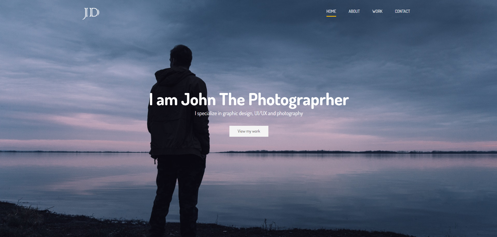

# John Doe's Portfolio

This is a portfolio website for John Doe, showcasing his skills as a UI/UX Designer & Photographer.

## Table of Contents

- [Description](#description)
- [Features](#features)
- [Installation](#installation)
- [Usage](#usage)
- [Credits](#credits)
- [License](#license)

## Description

This portfolio website serves as an online showcase of John Doe's work in graphic design, UI/UX design, and photography. The website is built using HTML, CSS, and JavaScript.

## Features

- Responsive design for various screen sizes.
- Sections for displaying John's specialization, creative process, technical skills, projects, and contact information.
- Integration with Font Awesome for icons.
- Utilization of Google Fonts for typography.
- A typewriter effect to dynamically display John's roles.
- Contact form with Netlify integration for form submission.
- Testimonials section to display client feedback.

## Installation

Clone with SSH key

```bash
git clone git@github.com:Ginjak/Portfolio_course_website.git
```

## Usage

1. [Project live link](https://objective-wright-f89c90.netlify.app/)
2. [GitHub repo](https://github.com/Ginjak/Portfolio_course_website)



## Credits

- Font Awesome: [https://fontawesome.com/](https://fontawesome.com/)
- Google Fonts: [https://fonts.google.com/](https://fonts.google.com/)
- Brad Traversy's Modern HTML & CSS course on Udemy for inspiration and learning resources.

## License

This project is licensed under the MIT License - see the [LICENSE](LICENSE) file for details.
